# BloodHound

> Full writeup also published at https://aerobytes.io/writeups/bloodhound/

BloodHound is one of those tools that makes Active Directory finally make more sense to me. It takes the tangled pile of users, groups, and permissions inside a domain, works out who can reach whom, and draws the whole thing as a graph you can follow (which is perfect for my visual learning style). This Hack Smarter lab, over at [www.hacksmarter.org](https://www.hacksmarter.org), is a friendly introduction to it. You begin with a single set of low-privilege credentials, and the job is to collect the domain data, load it into BloodHound, and follow the paths it lays out until you reach the domain administrator.

```
Username: pentest
Password: HackSmarter123!
```

---

## Collecting the Data

BloodHound is only ever as good as the data you hand it, so before any of the fun graphing happens, you have to pull that data out of the domain. A handful of ingestors all produce the same JSON, and picking one really comes down to the platform you are working from and how the target is set up. I worked through five of them here, since it helps to know your options.

### NetExec

NetExec is my preferred tool to start. It checks that the credentials work and then runs the collection in the same session, so you get your confirmation and your data without having to hop between tools. First, make sure the credentials are valid over SMB.

```
nxc smb [DC] -u '[USERNAME]' -p '[PASSWORD]' --shares
```

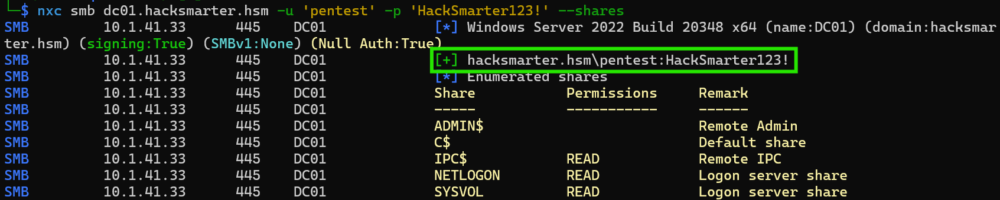

The `+` beside the credentials is what tells you they are good, and it's super important to confirm before moving on!

Once you know the login works, point NetExec at LDAP this time and let its built-in BloodHound collector do the gathering.

```
nxc ldap [DC-IP] -u '[USERNAME]' -p '[PASSWORD]' --bloodhound --collection All --dns-server [DC-IP]
```

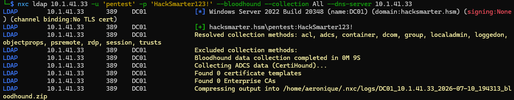

One command runs the collector across every collection method, which is why I think NetExec is such a good place to begin. The run drops a zip file, and unzipping it hands you the JSON documents you will load into BloodHound a little later.

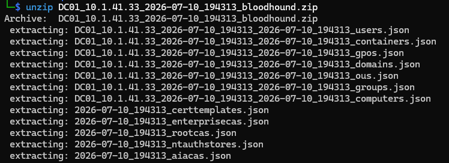

### SharpHound

SharpHound is the C# collector that runs right on a Windows target, and it is the one Defender is quick to flag, so don't be surprised when it gets caught as malware the moment it touches disk. You can grab it from [SpecterOps' GitHub releases](https://github.com/SpecterOps/SharpHound/releases).

To get it onto the box, open a session on the domain controller with `evil-winrm` using the same credentials you already have.

```
evil-winrm -i [DC] -u '[USERNAME]' -p '[PASSWORD]'
```

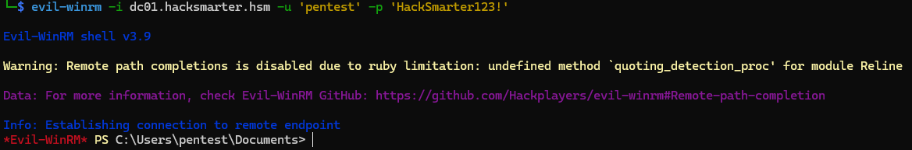

From inside that session, upload SharpHound to the target.

```
upload /path/to/SharpHound.exe
```

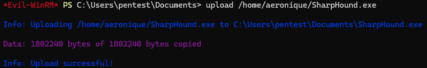

Give it a quick `dir` to make sure the file landed in the location you intended.

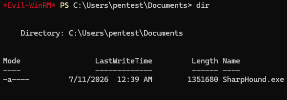

Now run SharpHound and let it collect across every method.

```
.\SharpHound.exe -c All
```

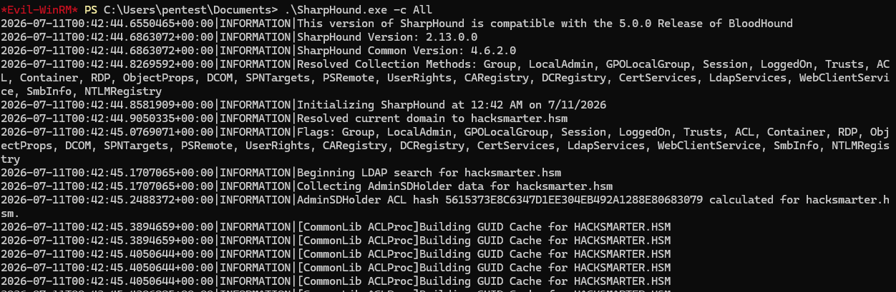

When it finishes, SharpHound writes the results to a zip file in whatever directory you are working from on the target.

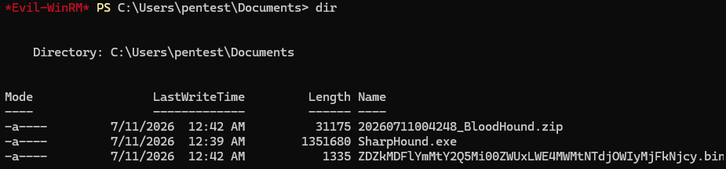

Pull that zip back to your own machine with `download`.

```
download [FILE]
```

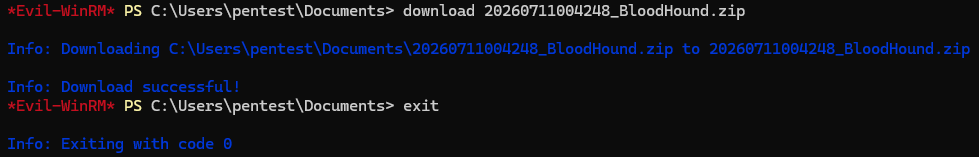

And with that, the collected files are ready to go.

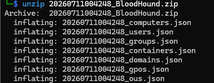

### RustHound

RustHound is a cross-platform ingestor written in Rust, and it is a great versatile little tool to have on hand. It compiles down to one small, quick binary for either Linux or Windows, and since it leans on no .NET at all, it stays light enough to drop onto almost any host.

Run it against the domain controller with your credentials and let it collect.

```
./rusthound -d [DC] -u 'username' -p 'password' -n [DC-IP] -o ./rusthound_output
```

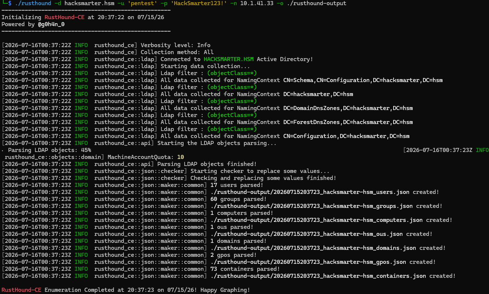

Change into that output directory and you will find the data already in its original JSON form, saved for you without any zipping to deal with first.

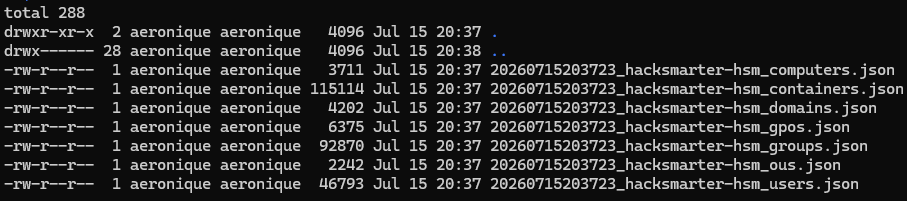

### bloodhound-python

When you are working entirely from Linux, `bloodhound-python` is a good choice. It's a Python ingestor that queries the domain controller over LDAP and asks for nothing you would not already have on a Linux box.

```
bloodhound-python -u 'username' -p 'password' -d [DOMAIN] -dc [DC-HOSTNAME] -c All -ns [DC-IP]
```

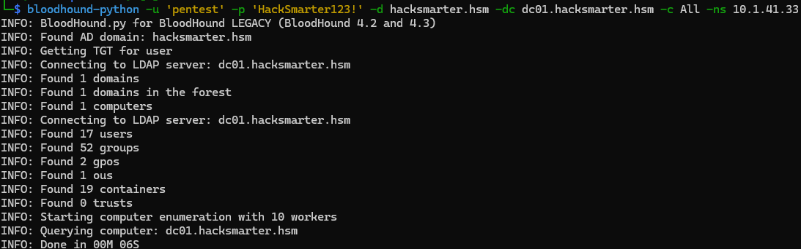

Once it finishes, the output saves into whatever directory you happened to be working in.

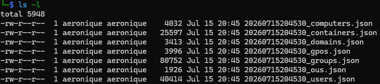

### bloodyad

`bloodyad` takes a little patience the first time, since its syntax is a bit particular, but it's complexity is worth the patience. It can reliably pull data from Windows Server 2025, where NetExec and bloodhound-python struggle, so it is a good one to have ready for really stubborn targets.

```
bloodyad -H [DC-HOSTNAME] -d [DOMAIN] -u 'username' -p 'password' get bloodhound
```

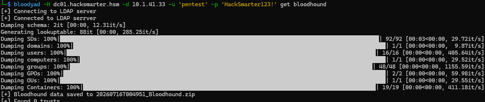

Whichever route you take, you end up in the same place, with a full set of data ready to load into BloodHound.

---

## Launching BloodHound

BloodHound ships with a CLI distribution from SpecterOps, written in Go, that quietly handles the container setup, the configuration, and the log wrangling so you do not have to. It runs happily on Windows, Linux, and macOS.

Grab the build that matches your system, unzip it, add `bloodhound-cli` to your path, then start up a local instance and open it in your browser. Make sure before setting the container up, that port `8080` is free, otherwise you'll need to specify a different port in the configuration.

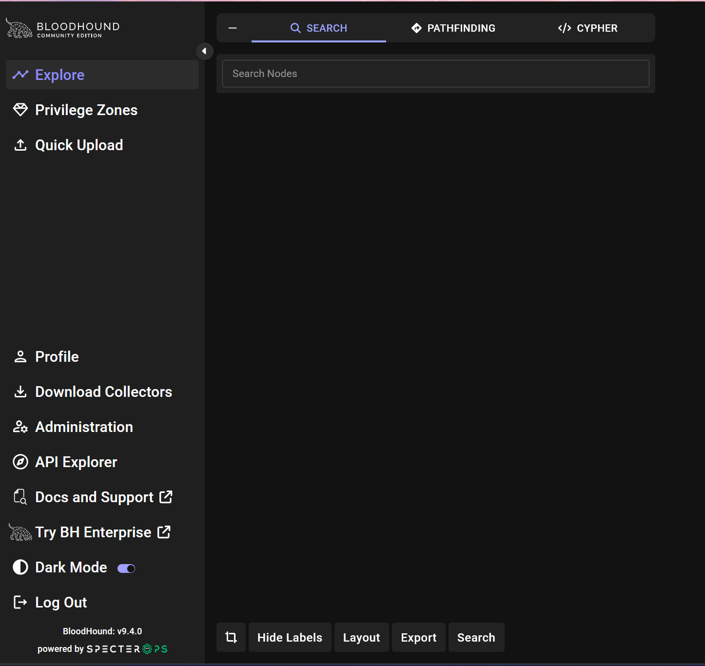

### Loading the Data

Head to Administration > File Ingest and upload the JSON files from whichever collector you used. BloodHound takes them all the same way, so it does not care which tool did the gathering.

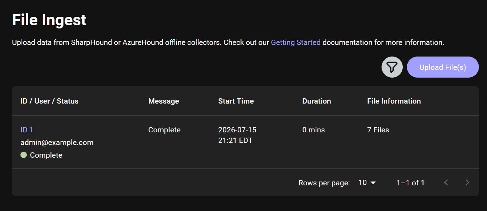

### Built-in Queries

Under Explore > CYPHER, BloodHound gives you a whole set of prewritten queries you can use with a single click, which means you can get straight to the interesting findings without having to write any Cypher by hand (it's a little... complex).

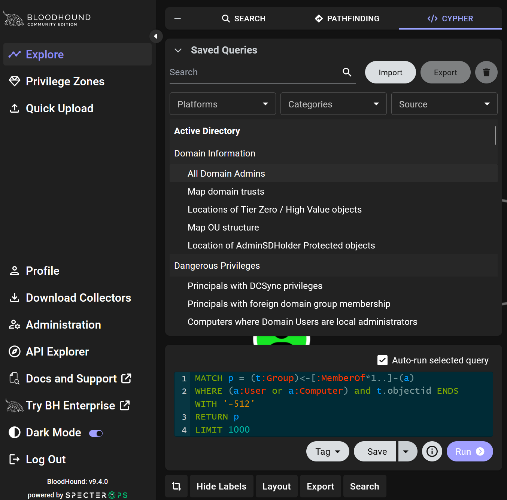

The queries I reach for first:

- **Paths from Domain Users to Tier Zero / High Value Targets.** This is the big one, the query that traces every known relationship from the lower-privileged objects all the way up to the highest tier of administrative control.
- **Shortest paths to Domain Admins.** This one narrows things down to the quickest route to a Domain Admin account, and if you can reach one, the entire domain is yours.
- **Find AS-REP Roastable / Kerberoastable Users.** This surfaces the accounts that are exposed to offline credential cracking, which often gives you an easy early foothold.

BloodHound draws the answer as a live map, laying the targets out on the right and the starting points you can use over on the left, so the route between them is easy to trace.

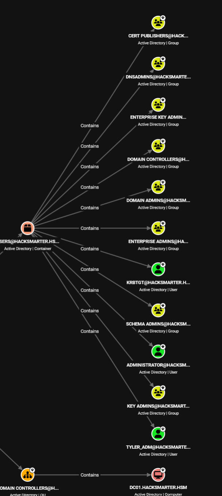

### User Nodes

Clicking on a user node opens a side panel packed with the account's properties and its relationships, and that panel quickly becomes the thing you spend most of your time reading.

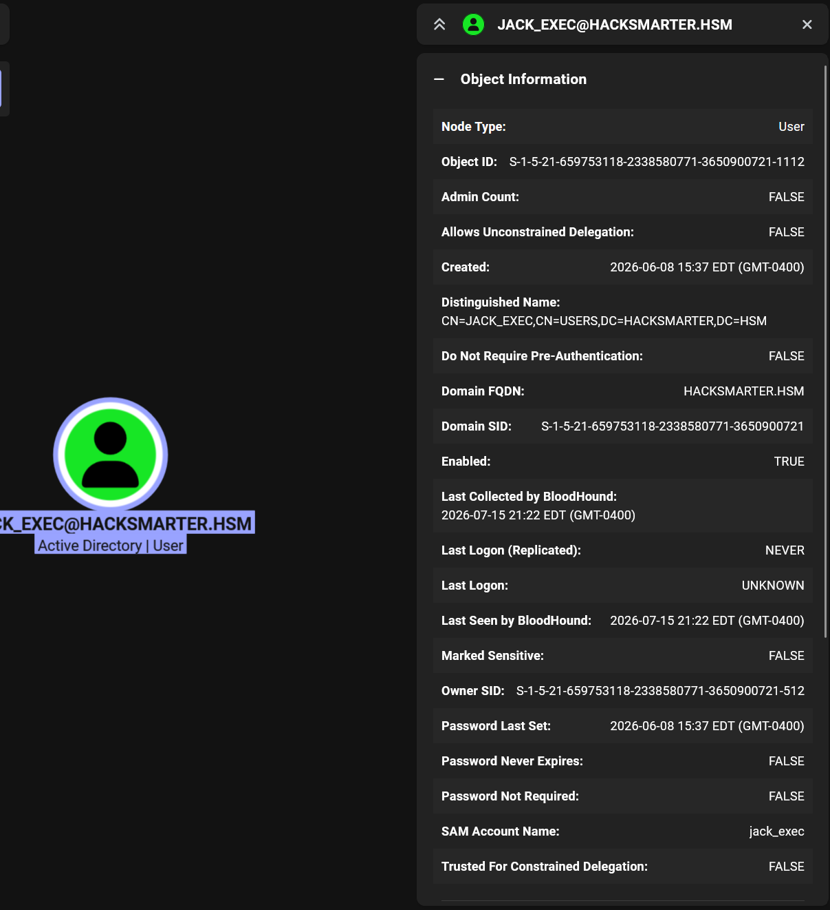

### Outbound Object Control

Outbound Object Control is the view you want to always check. It lays out every account a given user can act against, and that list is exactly the trail an attacker follows when they are looking for lateral movement and a way to climb.

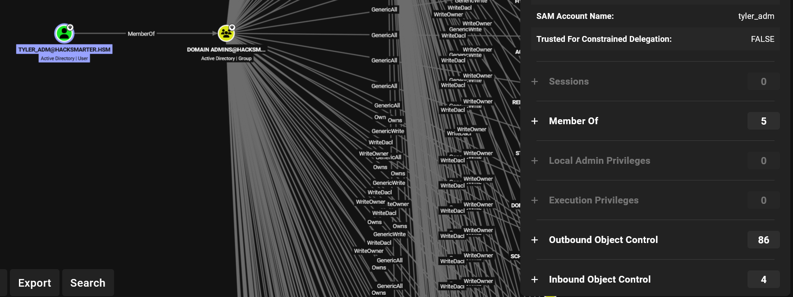

### ACLs

Active Directory leans on ACLs to decide who is allowed to modify what, and BloodHound lets you click on any edge to see the explicit control one object holds over another.

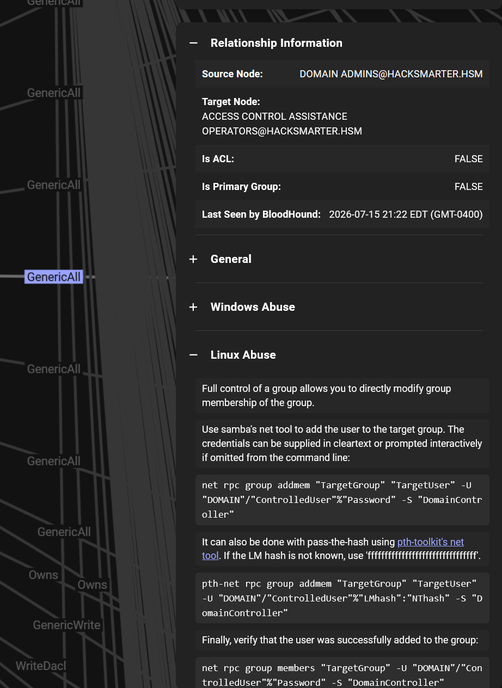

That same view is useful whichever side you are on. An attacker reads it to find their next target, and a defender reads it to spot the rights that were never supposed to be there in the first place.

---

## The Final Challenge

With the domain mapped out, the challenge is to recover the flag tucked away at `C:\Users\Administrator\Desktop\root.txt`, and you get to do it starting from the very same low-privilege credentials the lab handed you at the beginning.

```
username: pentest
password: HackSmarter123!
```

Start by tracking down the `pentest` user inside BloodHound.

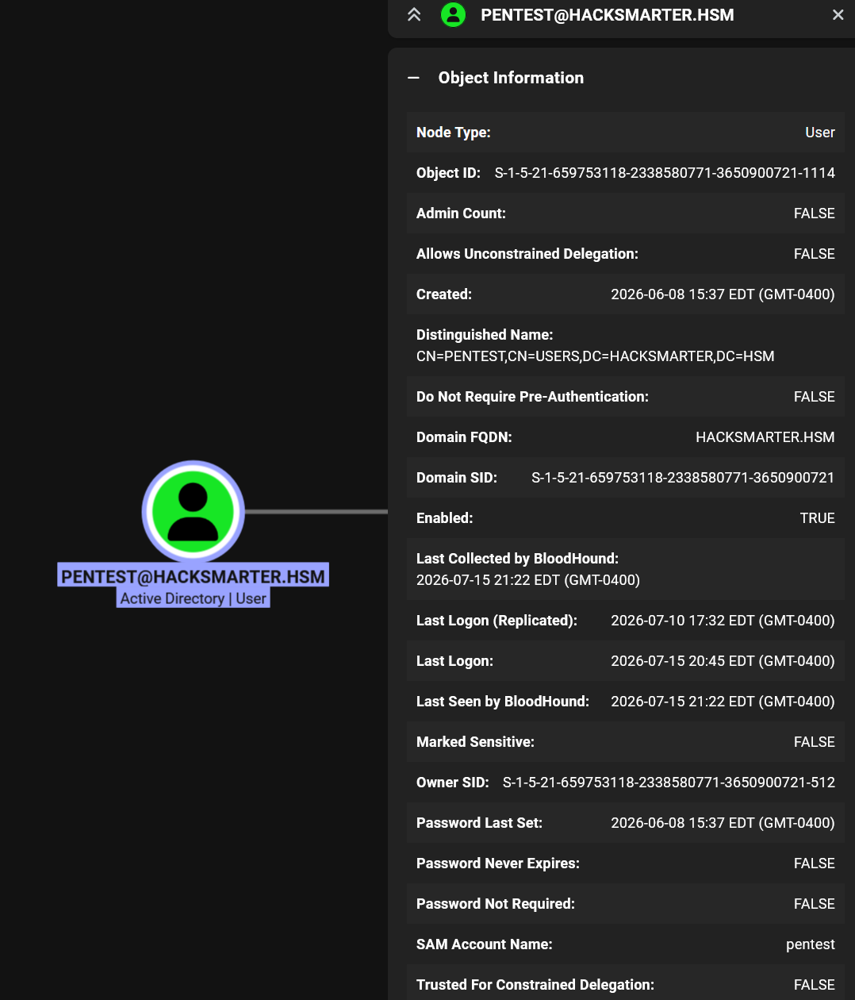

It turns out `pentest` has Outbound Object Control over the `backup_svc` user, and BloodHound is kind enough to spell out every way you can abuse that control.

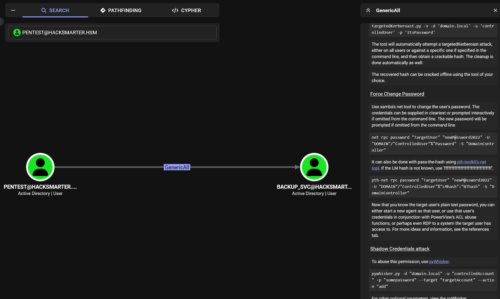

Since I was running this lab on Linux, I followed the Linux Abuse path and used it to change the `backup_svc` account password.

```
net rpc password "TargetUser" "newP@ssword2022" -U "DOMAIN"/"ControlledUser"%"Password" -S "DomainController"
```

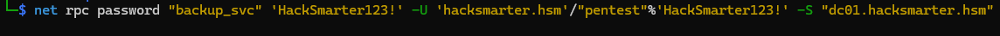

No output at all is the good sign here, since it means the password change went through cleanly. Confirm you really do have the account by checking the SMB shares with NetExec.

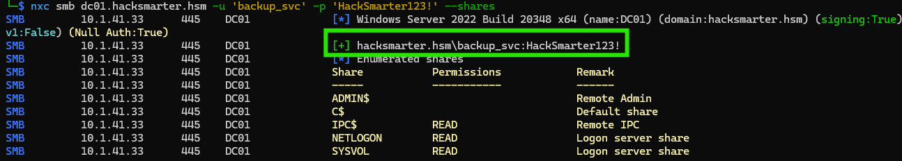

Back in BloodHound, right click the user and mark it as Owned now that the account belongs to you, which keeps the map organized as your path grows.

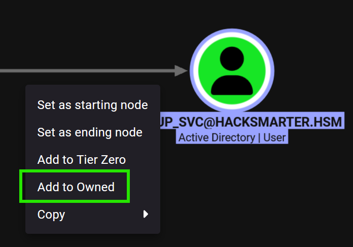

We are still short of any real admin rights, so the enumeration keeps going from this new account, and the first thing to read is its Outbound Object Control (sensing a pattern here).

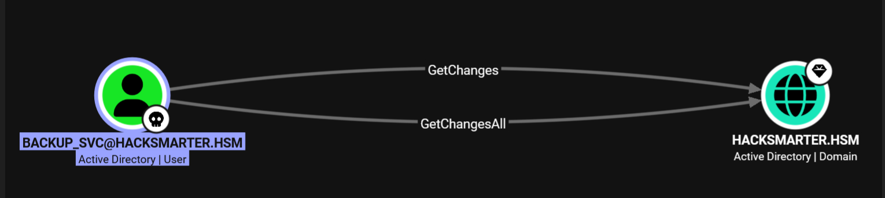

This is the moment the lab gets exciting. `backup_svc` holds `GetChanges` and `GetChangesAll` over the domain controller, and reading the description on those rights points straight at a DCSync attack.

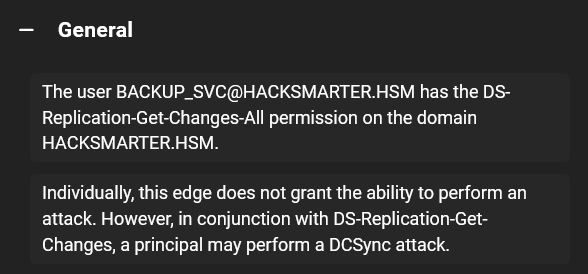

A DCSync attack asks the domain controller to replicate its directory data and, in doing so, dumps the password hashes for every account it holds. Pulling the `krbtgt` hash along the way can also set you up for a Golden Ticket attack down the line. NetExec handles the DCSync for you.

```
nxc smb [DOMAIN CONTROLLER] -u 'username' -p 'password' --ntds
```

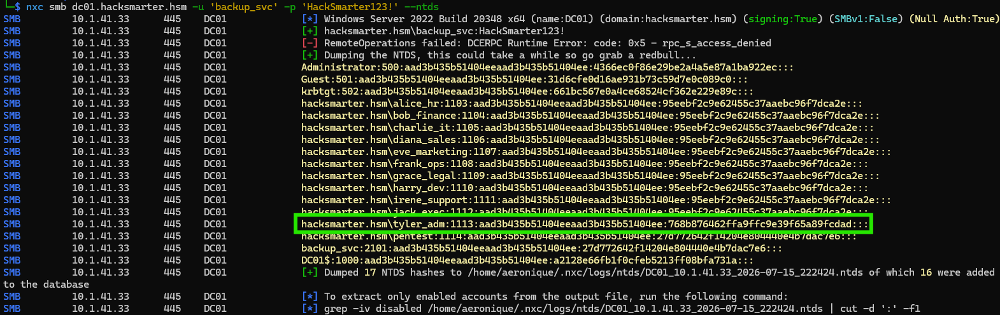

With all of those hashes in hand, grab the NTLM hash (the second hash) for the `tyler_adm` account and pass it to evil-winrm to open an administrative session.

```
evil-winrm -i [DOMAIN CONTROLLER] -u 'username' -H 'NTLM HASH'
```

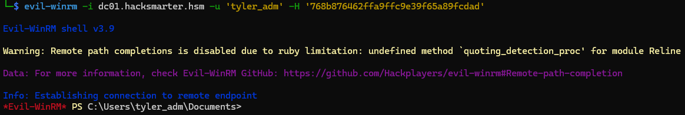

That drops you into an administrative shell, and the flag is sitting right there on the desktop waiting for you!

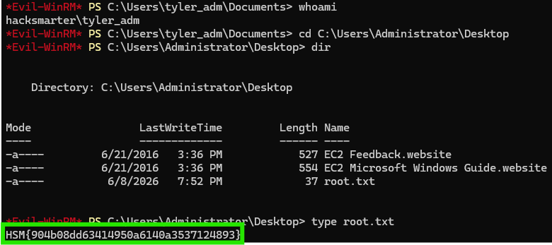

What I really enjoyed about this lab is how far plain enumeration carried the whole thing. Reading Outbound Object Control at each step was enough to turn one low-privilege account into control of the entire domain, first by resetting a forgotten service account password, and then by using that account's replication rights to run a DCSync and walk away with everything.

---

## Defensive Takeaways

- **Audit Outbound Object Control and dangerous ACLs.** The entire path here rode on write and replication rights that reached a good deal further than they ever needed to. Take a regular look at who holds `GenericAll`, `GenericWrite`, and write access over your service and privileged accounts, and quietly pull back anything that is not doing real work.
- **Watch for service account password resets.** The very first move was a `net rpc password` reset against `backup_svc`, so Event ID 4724 (a password reset attempt) and 4738 (an account being changed) on service accounts are both well worth alerting on.
- **Detect DCSync.** Replication rights like `GetChanges` and `GetChangesAll` really only belong to domain controllers, so a replication request coming from anything else is a strong sign of DCSync in progress. You can catch it through directory service access auditing and Event ID 4662 with the replication GUIDs.
- **Run BloodHound against your own domain.** The same collectors and queries an attacker would use will happily show you the shortest paths to Tier Zero inside your own environment, which gives you the chance to close them before anyone else goes looking.
