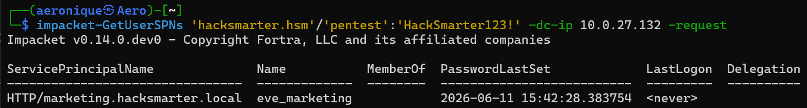
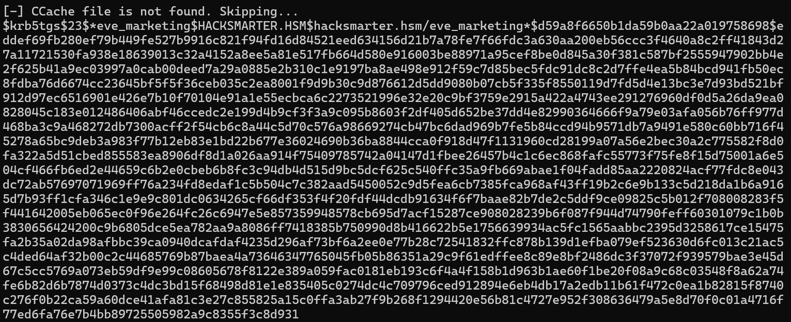
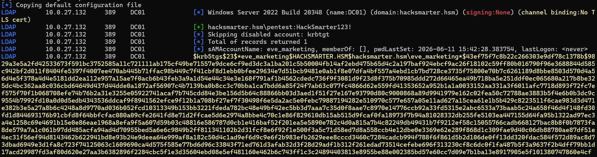
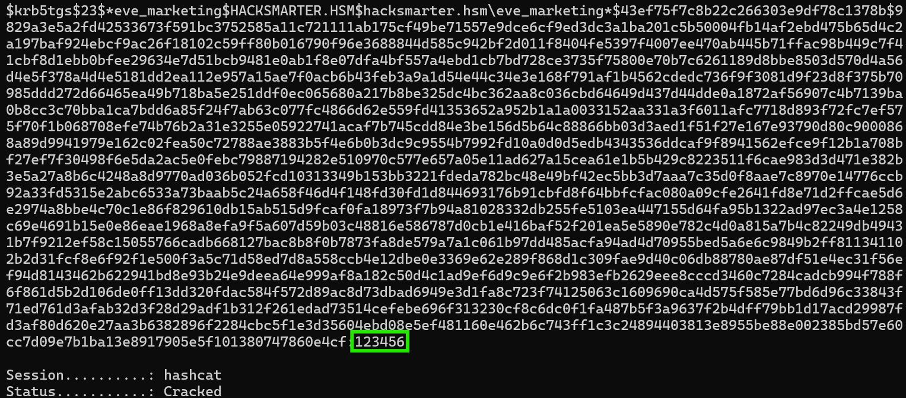
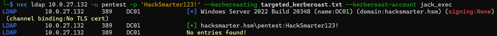
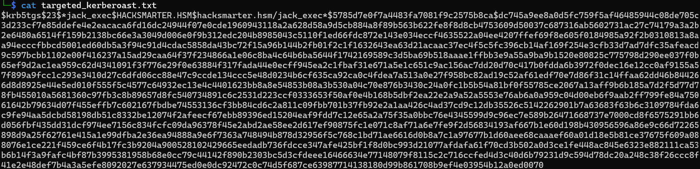
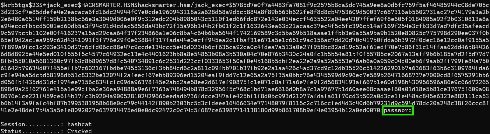
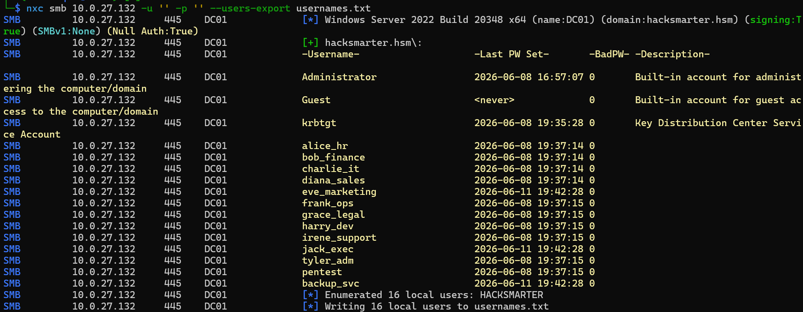
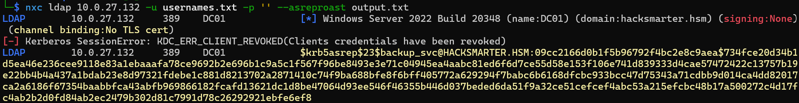
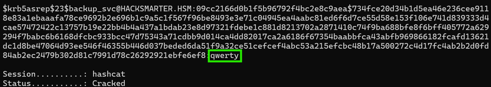

# Kerberoasting

> Full writeup also published at https://aerobytes.io/writeups/kerberoasting/

The starting position is a set of low-privilege Active Directory credentials, the kind you might pick up early in an engagement:

```
Username: pentest
Password: HackSmarter123!
```

Domain: `hacksmarter.hsm`
Domain Controller: `10.0.27.132`

The goal is to turn that single weak account into more accounts by abusing how Kerberos hands out service tickets.

## How Kerberoasting works

Kerberos issues two kinds of tickets. When a user logs in, the Key Distribution Center (KDC) on the domain controller gives them a Ticket Granting Ticket (TGT). When that user wants to reach a service, they present the TGT and ask for a service ticket, called a Ticket Granting Service (TGS) ticket. The KDC builds that service ticket and encrypts part of it with the password hash of the account that runs the service.

Services are tied to accounts through a Service Principal Name (SPN). Any account with an SPN set can have a service ticket requested against it, and here is the useful part for an attacker: any valid domain user can request that ticket, and the KDC hands it over without checking whether the requester should actually reach the service. Once the ticket is in hand, the encrypted section can be pulled off and cracked on your own machine, offline, with no failed-login traffic hitting the domain controller.

When the ticket uses RC4 encryption (type 23, shown as `$23$` in the hash), the encryption key comes straight from the service account's NTLM hash. So the crack is simple in concept: guess a password, compute its hash, and test whether it decrypts the ticket. Service accounts tend to carry old passwords that rarely rotate, which is why this attack succeeds so often.

---

## Standard Kerberoasting

### Impacket

`GetUserSPNs` asks the domain for every account that has an SPN and requests a TGS ticket for each one. The `-request` flag is what pulls the crackable ticket rather than only listing the accounts.

```
impacket-GetUserSPNs '[DOMAIN]'/'[USER]':'[PASSWORD]' -dc-ip [DC-IP] -request
```

Filled in for this lab:

```
impacket-GetUserSPNs 'hacksmarter.hsm'/'pentest':'HackSmarter123!' -dc-ip 10.0.27.132 -request
```



The tool finds one account, `eve_marketing`, with the SPN `HTTP/marketing.hacksmarter.local`, then prints the ticket straight to the terminal:



That `$krb5tgs$23$` string is the Kerberoast hash. The `$23$` confirms RC4, which is the format Hashcat expects for mode 13100.

### NetExec

NetExec reaches the same accounts over LDAP and writes the hash to a file in one step, which is convenient when you want it saved cleanly for cracking.

```
nxc ldap [DC-IP] -u [USERNAME] -p '[PASSWORD]' --kerberoasting hashes.txt
```



Same `eve_marketing` account, same ticket, now saved to `hashes.txt`.

### Hashcat

Mode `13100` covers RC4 Kerberos TGS tickets. Pointing it at the rockyou.txt wordlist runs each candidate password through the key derivation and tries to decrypt the ticket.

```
hashcat -m 13100 hashes.txt /usr/share/wordlists/rockyou.txt
```



`123456` sits near the top of rockyou, so the crack finishes almost instantly.

We now have the password for `eve_marketing`: `123456`

---

## Targeted Kerberoasting

Standard Kerberoasting only works against accounts that already have an SPN. Targeted Kerberoasting covers the case where the account you want has no SPN, but you hold a write privilege over it. If you can edit the target's attributes, you can add an SPN yourself, request the ticket, then remove the SPN to clean up after.

In this lab the `pentest` user has write access over `jack_exec`. BloodHound is the usual way to find this kind of edge (look for `GenericWrite`, `GenericAll`, or `WriteSPN` over a user). NetExec automates the full sequence with `--kerberoast-account`: it sets a temporary SPN on the target, roasts it, and removes the SPN when it finishes.

### NetExec attack

```
nxc ldap 10.0.27.132 -u 'pentest' -p 'HackSmarter123!' --kerberoasting targeted_kerberoast.txt --kerberoast-account jack_exec
```



NetExec reports `No entries found!` on the standing SPN enumeration because `jack_exec` has no permanent SPN, but it still applies the temporary SPN, captures the ticket, and writes it to the output file.

Reading the output file confirms the Kerberos hash for `jack_exec`:



Run it through Hashcat against rockyou.txt, same mode 13100:

```
hashcat -m 13100 targeted_kerberoast.txt /usr/share/wordlists/rockyou.txt
```



The `jack_exec` password turns out to be, fittingly, `password`.

---

## Kerberoasting via AS-REP Roasting

Everything above needed at least one valid password to get a TGT, and the TGT is what lets you request service tickets. This section covers starting with no password at all, by chaining AS-REP Roasting into Kerberoasting.

Kerberos preauthentication is the step where a client proves it knows the password before the KDC replies. When an account is configured with "Do not require Kerberos preauthentication," the KDC returns an AS-REP to anyone who asks, and part of that reply is encrypted with the account's password key. That gives you another offline-crackable hash without any credentials. Crack it, and you have a valid password that feeds right back into standard Kerberoasting.

First, we need a list of usernames to test. A null SMB session with an empty username and password is often enough to enumerate accounts:

```
nxc smb [DC-IP] -u '' -p '' --users-export usernames.txt
```



That returns 16 domain users written to `usernames.txt`.

With the list saved, test each account for the missing-preauth setting:

```
nxc ldap [DC-IP] -u [USERNAME-LIST] -p '' --asreproast output.txt
```



One account comes back with `KDC_ERR_CLIENT_REVOKED`, meaning its credentials are disabled, and `backup_svc` returns a `$krb5asrep$23$` hash. That account has preauthentication turned off.

You can also confirm the exposure and pull Kerberoast tickets directly through the no-preauth account, which is the full chain in one command:

```
nxc ldap [DC-IP] -u [USER] -p '' --no-preauth-targets [USERNAME-LIST] --kerberoasting kerberoast_hashes.txt
```

AS-REP hashes use Hashcat mode `18200`:

```
hashcat -m 18200 output.txt /usr/share/wordlists/rockyou.txt
```



The `backup_svc` password is `qwerty`. From there a valid credential gets a TGT, and the TGT opens up standard Kerberoasting across the rest of the domain.

---

## Mitigations

1. **Group Managed Service Accounts (gMSAs).** These assign 120-character passwords that the domain controller manages and rotates automatically, which removes the human-chosen weak password that Kerberoasting relies on.
2. **Long passwords on any remaining service account.** Treat a service account password like an encryption key: 25 to 30 random characters puts it well out of reach of wordlist and reasonable brute-force cracking.
3. **Upgrade encryption to AES.** Forcing AES-256 tickets removes the fast RC4 path. Strong passwords still do the heavy lifting, but AES raises the cost of every guess.
4. **Least privilege on account ACLs.** Targeted Kerberoasting depends on write access over another user. Review who holds `GenericWrite`, `GenericAll`, or write access to `servicePrincipalName`, and remove rights that are not needed.
5. **Remove "Do not require Kerberos preauthentication."** Audit accounts for the `DONT_REQ_PREAUTH` flag and clear it unless a legacy system genuinely requires it.

## Detection

- **Event ID 4769** (Kerberos service ticket request) with encryption type `0x17` (RC4) is a strong signal, especially in bursts against many different SPNs from one source.
- **Event ID 4768** (TGT request) with preauthentication not required helps surface AS-REP exposure.
- **Decoy service accounts.** A service account with an SPN, a long random password, and no real use makes a good canary. Any ticket request against it deserves a look.
- **SPN modification monitoring.** Targeted Kerberoasting writes and removes an SPN on a user account, so auditing changes to `servicePrincipalName` on user objects can catch it in progress.
